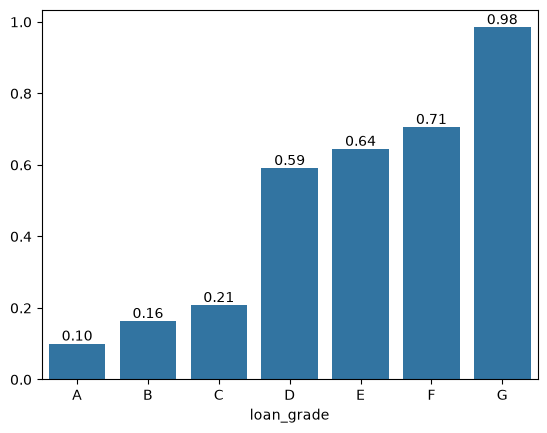
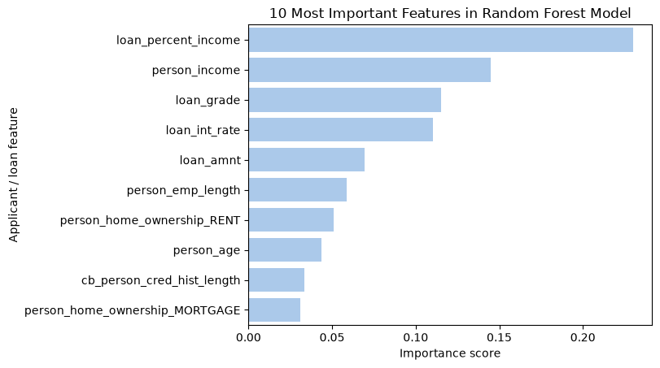

# Loan default prediction

Predicting which loan applicants are likely to default, and choosing how a bank should act on that prediction.

A random forest catches 71.6% of defaults with 97.7% precision, against 50.1% for a logistic regression baseline. Lowering the decision threshold to 0.3 raises the share of defaults caught to 76.9%, at the cost of more good loan profiles being rejected.

## The problem

Two kinds of error can occur while approving loans.
On one hand, approving an applicant who then defaults leads to the loss of a large part of the loan.
On the other, refusing an applicant who would have repaid loses the interest that could have been generated, and the customer.

The interest of this project is to build a model that estimates each applicant's probability of default from the information gathered through their application, then uses those two costs to decide where the bank should draw the line.

## The data

The data used in this project is the [Credit Risk Dataset](https://www.kaggle.com/datasets/laotse/credit-risk-dataset) (Kaggle): 32,581 historical loan applications, 12 columns. One row is one application. The target is `loan_status` (1 = default, 0 = repaid).

| Column | Type | Meaning |
| --- | --- | --- |
| `person_age` | integer | Applicant's age in years |
| `person_income` | integer | Applicant's annual income |
| `person_home_ownership` | text | Housing status: RENT, OWN, MORTGAGE or OTHER |
| `person_emp_length` | decimal | Years in current employment |
| `loan_intent` | text | Purpose of the loan: EDUCATION, MEDICAL, VENTURE, PERSONAL, DEBTCONSOLIDATION or HOMEIMPROVEMENT |
| `loan_grade` | text | Risk grade assigned to the loan, from A (lowest risk) to G (highest) |
| `loan_amnt` | integer | Amount borrowed |
| `loan_int_rate` | decimal | Interest rate of the loan, in % |
| `loan_status` | 0 / 1 | Target: 1 = default, 0 = repaid |
| `loan_percent_income` | decimal | Loan amount as a share of annual income (0.25 = 25%) |
| `cb_person_default_on_file` | text | Past default on the applicant's credit record: Y or N |
| `cb_person_cred_hist_length` | integer | Length of the applicant's credit history, in years |

## Cleaning the data

I started by cleaning the data, and a few inconsistencies were noticed, starting with impossible values, found by checking columns against each other. Two applicants aged 21 and 22 had 123 years of employment. Equally, the age distribution runs smoothly up to 94 and then jumps to 123 and 144 years old. Those ages also came with loan purposes that don't fit (Venture and Education). Older applicants with 0 years employed and medical loans were kept, since a retired applicant is plausible.

Only the incoherent or impossible values were replaced, with the column's median computed without the incorrect rows, so the rest of each applicant's data was kept.

The columns `person_emp_length` and `loan_int_rate` had respectively 895 and 3,116 missing values, which were then filled with their medians (4 years and 10.99%). Dropping the 3,943 incomplete rows would have discarded 12% of the data.

## Exploring the data

Then I moved on to the exploration of the data. The goal was to find which characteristics differ between applicants who defaulted and applicants who repaid.
Each candidate column was compared across the two groups with pandas `groupby`. Because `loan_status` is 0 or 1, its mean within a group is that group's default rate.

### How imbalanced is the target?

`df["loan_status"].value_counts(normalize=True)` shows that 21.8% of loans defaulted and 78.2% were repaid. A model that always predicts "repaid" would therefore be right 78.2% of the time while catching no defaults.

Conclusion: accuracy cannot judge these models; recall and precision on defaults are used instead.

### Does the bank's own risk grade predict default?

`df.groupby("loan_grade")["loan_status"].mean()` gives the default rate per grade:

| Grade | A | B | C | D | E | F | G |
| --- | --- | --- | --- | --- | --- | --- | --- |
| Default rate | 10.0% | 16.3% | 20.7% | 59.0% | 64.4% | 70.5% | 98.4% |



The default rate goes up at every grade, but there is a big jump between C (20.7%) and D (59.0%).

Conclusion: the grade is a strong predictor. The jump also works like a threshold, which a model drawing a single straight line handles badly. This is one of the reasons the random forest does better than the logistic regression later on.

### Do defaulters pay higher interest rates?

`df.groupby("loan_status")["loan_int_rate"].mean()` gives 12.9% for applicants who defaulted, against 10.5% for applicants who repaid.

Conclusion: riskier borrowers are charged more, and they still default more often. The bank's pricing follows the risk, but it doesn't prevent defaults.

### Is it the income, or the size of the loan compared to the income?

I compared income and the loan-to-income ratio the same way:

| | Defaulters | Repaid |
| --- | --- | --- |
| Annual income | $49,126 | $70,804 |
| Loan as share of income | 24.7% | 14.9% |

Both are different between the two groups, so there were two possible explanations. Either people with lower incomes default more, or people default when the loan is too big compared to what they earn. These two columns are also linked, since the ratio is the loan amount divided by the income.

To separate them, I isolated the applicants who should be safe if income was what mattered: people earning more than $70,000 (around the average income of the repaid group) whose loan was more than 24% of their income (around the average ratio of the defaulters).

```python
high_income_high_ratio = df[(df["person_income"] > 70000) & (df["loan_percent_income"] > 0.24)]
high_income_high_ratio["loan_status"].mean()
```

883 applicants match, and 32.3% of them defaulted, which is above the 21.8% average.

Conclusion: a high income does not protect a borrower once the loan takes a large share of it. The loan-to-income ratio shows the capacity to repay better than the income alone. The model confirmed it later on its own: the ratio is its most important feature.

### What I took from the exploration into the modeling

- Four strong signals: loan grade, interest rate, income, and loan-to-income ratio.
- The classes are imbalanced, so the models are judged on recall and precision, not accuracy.
- Some columns carry the same information (grade and interest rate, income and ratio), which matters when reading the feature importance.

## Preparing the data for the models

Models only work with numbers, so the four text columns had to be encoded, each one depending on its structure:

- `cb_person_default_on_file` only has two values (Y/N), so I mapped it to 1 and 0.
- `loan_grade` has an order (A is better than G), so I mapped it from A = 0 to G = 6 to keep that order.
- `loan_intent` and `person_home_ownership` have no order, so I used one-hot encoding (one 0/1 column per category).

This gives 19 numeric features.

I then split the data into a training set (80%) and a test set (20%) that the model never sees until the evaluation. The split is stratified, so both sets keep the same 21.8% of defaults. Finally, I scaled the features with the scaler fitted on the training set only, so that no information from the test set leaks into the preparation.

## The models

I started with a logistic regression as a baseline, then compared it with a random forest (100 trees). Both were evaluated on the same 6,517 test loans, which include 1,422 real defaults.

| | Logistic regression | Random forest | Random forest, threshold 0.3 |
| --- | --- | --- | --- |
| Accuracy | 85.6% | 93.4% | 91.8% |
| Defaults caught | 713 | 1,018 | 1,094 |
| Missed defaults | 709 | 404 | 328 |
| Good customers refused | 231 | 24 | 208 |
| Recall | 50.1% | 71.6% | 76.9% |
| Precision | 75.5% | 97.7% | 84.0% |

Recall is the share of real defaults the model caught. Precision is the share of flagged applicants who really defaulted.

The random forest is better than the baseline on every measure: it misses 305 fewer defaults and refuses 207 fewer good customers.

### What drives the predictions



The loan's share of income is the strongest signal (23% of the importance), then the income (14.5%), the loan grade (11.5%) and the interest rate (11.0%). Together they make up 60%, and they are the same four signals I found during the exploration.

## Recommendation

With the default threshold of 0.5, the model is very careful: it almost never refuses a good customer, but it lets 404 defaults through. When I lowered the threshold to 0.3, it caught 76 more defaults but refused 184 more good customers, so about 2.4 good customers refused for each extra default caught.

I would recommend the 0.3 threshold if a default costs the bank more than 2.4 times the interest lost on a refused good customer. In consumer lending, a default usually costs a large part of the loan, so the lower threshold is probably the better choice. The exact cut-off should be set with the bank's own loss and margin figures.

## Limits

- The data is public and anonymized, so this project shows the method, not a real production system.
- I tried the 0.3 threshold directly on the test set, so its results are slightly optimistic. A stricter way would be to choose it on a separate validation set.
- The models use their default settings, without tuning or cross-validation.
- The feature importance shows how much a feature is used, not in which direction, and linked features (like grade and interest rate) share their importance.

## Next steps

- Choose the threshold on a validation set and use cross-validation.
- Compare with a gradient boosting model.
- Deploy the model as an API.
- Generate a plain-language explanation for each decision.

## How to run

```bash
git clone <this-repo-url>
cd credit-risk-default-prediction
python3 -m venv .venv
source .venv/bin/activate
python -m pip install pandas numpy matplotlib seaborn scikit-learn jupyter ipykernel
```

1. Download `credit_risk_dataset.csv` from the Kaggle page above into a `data/` folder.
2. Open `notebooks/01_exploration.ipynb`, select the `.venv` kernel, and run all the cells.

Tools: Python, pandas, NumPy, scikit-learn, Matplotlib, seaborn, Jupyter, Git.
